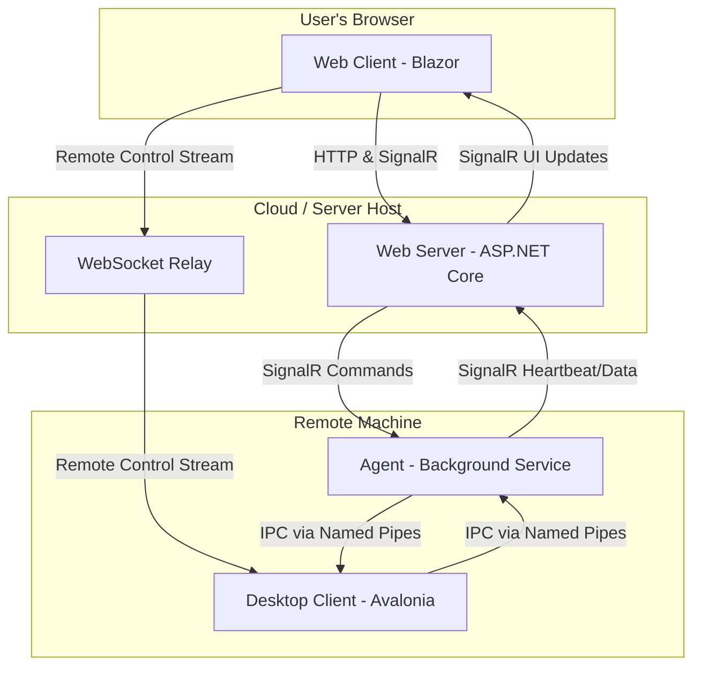

# Project Overview

ControlR is a cross-platform solution for remote access and remote control of devices. It primarily uses the latest .NET version for backend web, frontend web (via Blazor), and the desktop applications.

## Quick Start

The easiest way to build and run the application is to use the provided launch profiles in your IDE.

- **Visual Studio / JetBrains Rider:** Use the **"Full Stack"** launch profile to start all the necessary projects for a complete debugging experience.
- **VS Code:**
  - Use the **"Full Stack (Debug)"** config in `launch.json` for general debugging.
  - Use the **"Full Stack (Hot Reload)"** config for Blazor UI development to get fast feedback on changes.
- **CLI:** To simply build the entire solution, run `dotnet build ControlR.slnx` from the root directory.

## Context Scope

- Do not include any files or folders within `ControlR.Web.Server/novnc/` in your context.
- Do not include anything within folders named `node_modules` in your context.

## High-Level Architecture

The following diagram shows the communication flow between the major components of the system.

## Project Structure

### Core Components

- **ControlR.Web.Server** - ASP.NET Core web server with API endpoints and SignalR hubs
- **ControlR.Web.Client** - Blazor WebAssembly frontend using MudBlazor components
- **ControlR.Web.AppHost** - .NET Aspire orchestration host for development
- **ControlR.Web.ServiceDefaults** - Shared service configuration and defaults
- **ControlR.Web.WebSocketRelay** - WebSocket relay service for real-time communication
- **ControlR.Agent** - Background service/daemon that runs on controlled devices
- **ControlR.DesktopClient** - Cross-platform Avalonia UI desktop application

### Platform-Specific Components

- **ControlR.DesktopClient.Windows** - Windows-specific desktop client implementations
- **ControlR.DesktopClient.Linux** - Linux-specific desktop client implementations
- **ControlR.DesktopClient.Mac** - macOS-specific desktop client implementations
- **ControlR.DesktopClient.Common** - Shared desktop client functionality
- **ControlR.Agent.Common** - Shared agent functionality across platforms

### Shared Libraries

- **ControlR.Libraries.Shared** - Core shared models, DTOs, and utilities
- **ControlR.Libraries.DevicesCommon** - Device-related common functionality
- **ControlR.Libraries.DevicesNative** - Native device interaction libraries
- **ControlR.Libraries.Clients** - Client-side shared functionality
- **ControlR.Libraries.ApiClient** - Generated API client for server communication
- **ControlR.Libraries.Ipc** - Inter-process communication utilities
- **ControlR.Libraries.Signalr.Client** - SignalR client abstractions
- **ControlR.Libraries.WebSocketRelay.Common** - WebSocket relay shared components
- **ControlR.Libraries.NativeInterop.Windows** - Windows native interop
- **ControlR.Libraries.NativeInterop.Unix** - Unix/Linux native interop

## Communication Architecture

### SignalR Hub Pattern

- **AgentHub** - Receives device heartbeats and forwards data to ViewerHub groups
- **ViewerHub** - Handles web client connections and remote control requests
- Agents send `DeviceDto` heartbeats via `UpdateDevice()` which triggers real-time UI updates
- Hub groups organize connections by tenant, device tags, and user roles for targeted messaging

### Agent-DesktopClient IPC

- Agent runs as system service/daemon, DesktopClient runs in user sessions
- Communication via named pipes using `IIpcConnection` abstractions
- Agent forwards remote control requests to appropriate DesktopClient via `RemoteControlRequestIpcDto`
- DesktopClient reports back to Agent, which relays to web server via SignalR

## Technology Stack

### Backend

- **.NET 9** - Latest .NET framework
- **ASP.NET Core** - Web framework for APIs and web hosting
- **SignalR** - Real-time communication
- **Entity Framework Core** - ORM for database operations
- **PostgreSQL** - Primary database (with InMemory option for testing)

### Frontend

- **Blazor WebAssembly** - Client-side web UI framework
- **MudBlazor** - Material Design component library
- **JavaScript Interop** - For browser-specific functionality

### Desktop Applications

- **Avalonia UI** - Cross-platform .NET UI framework
- **Multi-targeting** - Supports Windows, Linux, and macOS
- **Native Interop** - Platform-specific functionality via P/Invoke
- **Avalonia Icons** - Avalonia Icons can be retrieved from here: https://avaloniaui.github.io/icons.html. They should be added to the `Icons.axaml` resource dictionary as needed.
- **Localization** - Don't use hardcoded strings in the UI.
  - In AXAML, bind to the `Localization` class properties. Example: `Content="{x:Static common:Localization.OkText}"`
  - Add keys and values to the JSON files under `/ControlR.DesktopClient.Common/Resources/Strings/`.

## Architecture Patterns

### Web Architecture

- **Clean Architecture** - Separation of concerns with clear dependencies
- **Dependency Injection** - Built-in .NET DI container

### Service Registration

In general, services are not registered directly in `Program.cs`. Instead, extension methods are used to group service registrations for different parts of the application. Here's where you can find the main service registration methods for each project:

- **ControlR.Agent**: `AddControlRAgent` in `ControlR.Agent.Common\Startup\HostBuilderExtensions.cs`
- **ControlR.Web.Server**: `AddControlrServer` in `ControlR.Web.Server\Startup\WebApplicationBuilderExtensions.cs`
- **ControlR.Web.Client**: `AddControlrWebClient` in `ControlR.Web.Client\Startup\IServiceCollectionExtensions.cs`
- **ControlR.DesktopClient**: `AddControlrDesktop` in `ControlR.DesktopClient\StaticServiceProvider.cs`

### Desktop Architecture

- **MVVM Pattern** - Model-View-ViewModel for UI separation
- **Localization** - `Localization.cs` will pull region-specific strings from `/Resources/Strings/{locale}.json`
  - All text in the UI should be bound to localization keys using `x:Static`
- **Command Pattern** - For user actions and operations
- **IMessenger** - Cross-component communication
- **Service Layer** - Business logic abstraction

### Cross-Platform Strategy

- **Shared Libraries** - Common functionality across platforms
- **Platform Abstraction** - Interface-based platform-specific implementations
- **Conditional Compilation** - Platform-specific code paths
- **Agent service layout** — The shared library `ControlR.Agent.Common` organizes platform-specific implementations under platform-named `Services` sub-namespaces/folders (for example `.Services.Windows`, `.Services.Linux`, `.Services.Mac`). Interfaces live in the common namespace and the platform implementations are selected via conditional compilation, platform attributes, or at host registration time.
- **DesktopClient per-platform projects** — The Desktop client isolates native UI/OS integrations into separate projects (`ControlR.DesktopClient.Windows`, `.Linux`, `.Mac`) while keeping shared UI and view-model code in `ControlR.DesktopClient.Common`. `ControlR.DesktopClient.csproj` conditionally references or multi-targets the appropriate platform project so only the target-OS code is built and linked. This keeps native UI and OS integrations isolated in their own projects while allowing shared UI and view-model code to remain common.

## Key Features

- **Remote Desktop Control** - Full desktop access and control
- **Screen Sharing** - Real-time screen streaming
- **File Transfer** - Secure file operations between devices
- **Multi-tenancy** - Support for multiple organizations
- **Self-hosting** - Can be deployed on-premises
- **Cross-platform** - Windows, Linux, macOS support
- **Authentication** - Identity Framework with optional OAuth integration (GitHub, Microsoft)
- **Real-time Communication** - SignalR and WebSocket support

## Development Guidelines

### General Coding Standards

- Use 2 spaces for indentation
- Don't try to be overly clever. Code should be easily readable.
- Don't try to fit everything on one line. Use white space for readability.
- **CRITICAL: All code written is production code.** Never write placeholder implementations, TODOs, or comments suggesting the code needs improvement "in production" or is a "simplification". Every implementation must be complete, correct, and production-ready.
- **Never use phrases like:**
  - "In production, you should..."
  - "This is a simplification..."
  - "This assumes..." (unless documenting actual API contracts)
  - "This is an estimate..."
  - "// TODO:", "// FIXME:", "// HACK:", etc.
- **If you don't know how to implement something correctly:**
  - Research the proper implementation
  - Ask for clarification
  - DO NOT write incomplete code with apologetic comments
- **All implementations must handle:**
  - Edge cases appropriately
  - Error conditions with proper error handling
  - Resource cleanup (dispose patterns, etc.)
  - Thread safety where applicable
  - Format variations, null checks, boundary conditions

### Build and Task System

- Use the following build command to verify that changes compile: `dotnet build ControlR.slnx --verbosity quiet`
  - If successful, there will be no output.
  - If unsuccessful, errors will be displayed.
- When a terminal task outputs "Terminal will be reused by tasks, press any key to close it.", interpret this as the task completion signal.
  - If no errors were displayed prior to this message, treat the task as successful.
  - Do not wait for user interaction or attempt to close the terminal. Proceed immediately to the next step.
- Do not attempt to fix warning `BB0001: Member '{member_name}' is not in the correct order`.  You are really bad at fixing this. Just mention it in your summary, and I'll fix it.

### C# Coding Standards

- Use the latest C# language features and default recommendations.
- Use StyleCop conventions when ordering class members.
- Do not use null-forgiving operator (!) outside of tests. Handle null checks appropriately.
- Prefer var of explicit types for variables.
- Reduce indentation by returning/continuing early and inverting conditions when appropriate.
- Always prefer collection expressions to initialize collections (e.g. '[]').
- If an interface only has one implementation, keep the interface and implementation in the same file.
- Do not leave comments that reference historical changes, prior implementations, or what was fixed. Comments should explain current intent only.
- Don't append "Async" suffix to async method names, unless to specifically distinguish from an existing sync method of the same name.
- Open and close braces should be on their own lines.

### Platform-Specific Development

- Use `[SupportedOSPlatform]` attributes for platform-specific code
- Conditional compilation symbols: `WINDOWS_BUILD`, `MAC_BUILD`, `LINUX_BUILD`, `UNIX_BUILD`
- Platform detection via `ISystemEnvironment.Platform` and `RuntimeInformation`

### Web UI Guidelines

- Use MudBlazor components where appropriate for the UI.
- When making changes to `.razor` files, check if there's a code-behind `.cs` file associated with it. If so, add your C# code there, including service injections.
- Prefer using code-behind CS files for Razor components instead of using the `@code {}` block in Razor files.

### Project Organization

- Follow the established folder structure and naming conventions.
- Keep platform-specific code in appropriate platform projects.
- Use shared libraries for common functionality across projects.
- DTOs go under `/Libraries/ControlR.Libraries.Shared/Dtos/`, under their respective namespace.
  - `HubDtos` contain DTOs used in SignalR hubs.
  - `IpcDtos` contain DTOs used in the IPC connection between `Agent` and `DesktopClient`.
  - `ServerApi` contains DTOs used in the REST API.
  - `StreamerDtos` contain DTOs used by remote control, which get routed through the websocket relay.
- Maintain clear separation between business logic and UI code.
- **Planning documents and implementation notes** should be placed in the `/.plans/` directory, NOT committed to the main source tree.
- **Do not create random public classes** in files containing other classes. Instead:
  - Use existing shared types from `ControlR.Libraries.Shared.Primitives` when available (e.g., `Result<T>`)
  - If a new type is needed, create it in its own file in the appropriate namespace
  - Check for existing types before creating duplicates

### SignalR Communication Patterns

- Device heartbeats flow: `Agent` → `AgentHub.UpdateDevice()` → `ViewerHub` groups
- Remote control requests: `ViewerHub` → `AgentHub` → `IPC` → `DesktopClient`
- Use hub groups for tenant isolation and role-based access control
- Group naming pattern: `HubGroupNames.GetTenantDevicesGroupName()`, `GetTagGroupName()`, etc.

### Testing Strategy

- Use xUnit for unit testing.
- Write unit tests for business logic and services.
- Maintain test coverage for shared libraries.
- For server tests, use helpers `Tests\ControlR.Web.Server.Tests\Helpers\` when appropriate.

### Security Considerations

- Always validate and sanitize user inputs.
- Use `AuthorizeAttribute` and `IAuthorizationService` for endpoint authorization.

### Performance Guidelines

- Optimize database queries with proper indexing.
- Use async/await patterns for I/O operations.
- Cache frequently accessed data appropriately.

### Error Handling

- Use structured logging with Serilog.
- Implement proper exception handling and recovery.
- Provide meaningful error messages to users.
- Log errors with appropriate context for debugging.

### Documentation

- Use XML documentation comments for public APIs.
- Maintain README files for complex components.
- Document configuration options and environment variables.
- Keep API documentation up to date.
