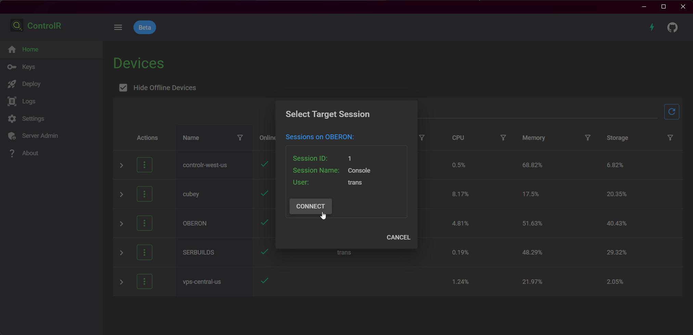
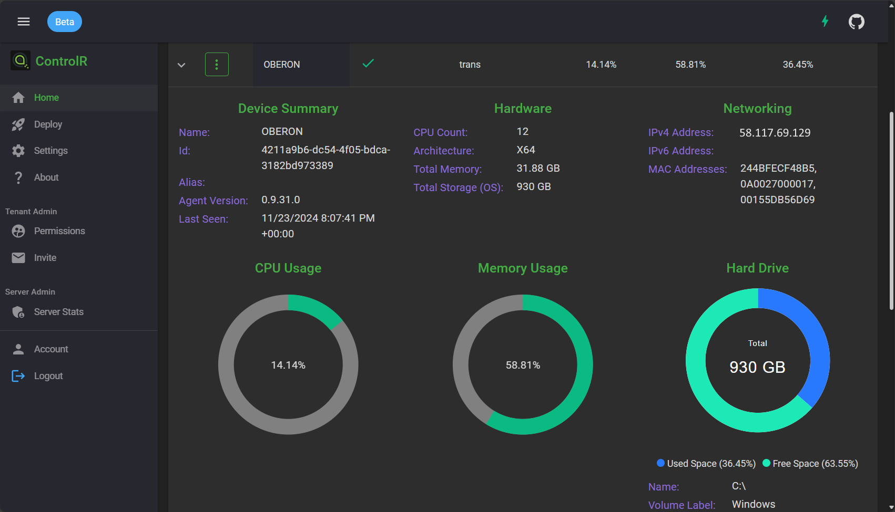
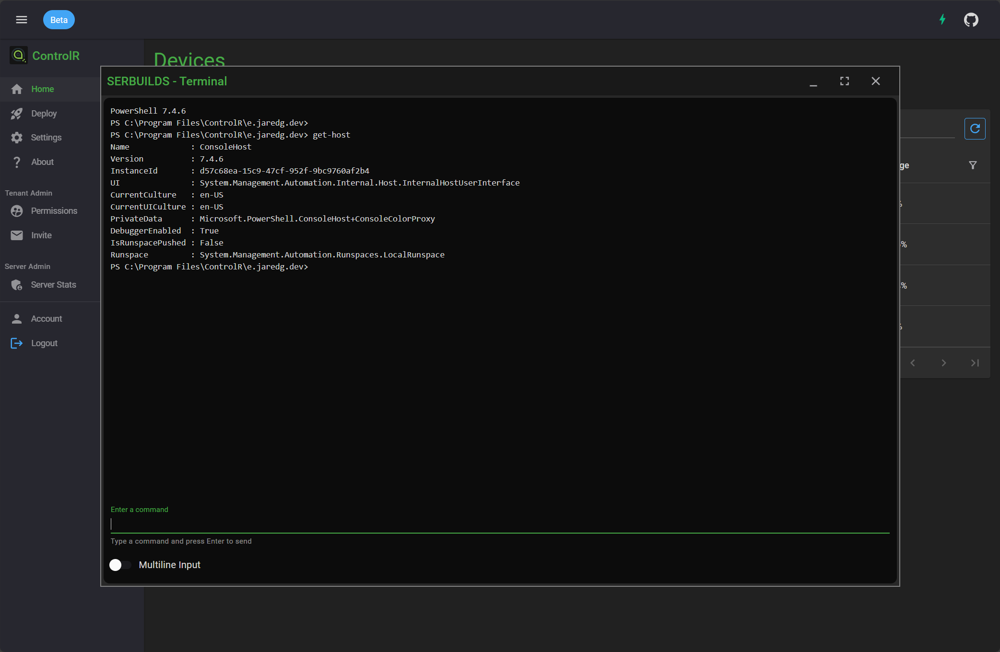
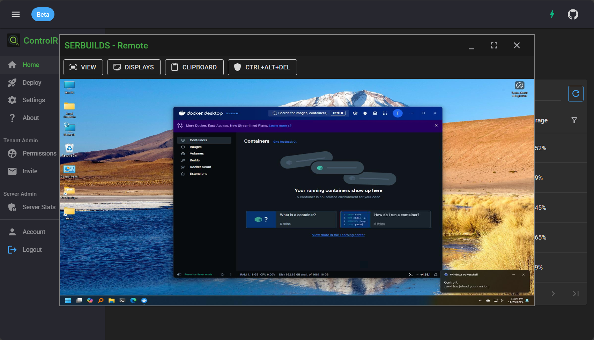
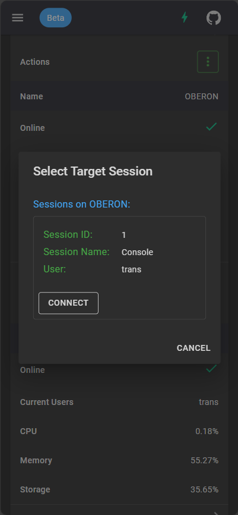

# ControlR

Open-source, self-hostable remote control and remote access.

[](https://dev.azure.com/translucency/ControlR/_build/latest?definitionId=35&branchName=main)
[](https://discord.gg/JWJmMPc72H)

Website: https://controlr.app  
Docker: https://hub.docker.com/r/translucency/controlr  
Discussions: https://github.com/bitbound/ControlR/discussions  
Project Board: https://github.com/users/bitbound/projects/1

## Project Goal:

First, thank you for checking out my project! I hope you find it useful. Since I'm using this for my own family's computers, the project will be supported for the foreseeable future.

Second, I want to be completely transparent about the goals for this project. Hopefully this will help you decide whether you want to use it and provide clarity about why some feature requests might get denied.

The primary goal for ControlR is to provide a simple, mobile-friendly tool for controlling a small number of computers. It's basically a tool I'm designing for myself and sharing freely.

In order to avoid some of the mistakes (and burnout) I experienced with Remotely (my previous project), I usually won't work on any features that I wouldn't personally use. Or if I feel like the required development time isn't worth it. These requests will likely be closed as `won't do`.

Please understand this isn't intended to sound rude. I just want to be clear with my intentions. Software development is an extremely time-consuming process, and I won't be committing the same amount of time or energy as I did with Remotely.

On the positive side, keeping the feature scope narrowly-defined ensures my ability to continue supporting the project.

## Quick Start:

### Public Server

Go to https://controlr.app and create an account.

### Self-Hosted

```
wget https://raw.githubusercontent.com/bitbound/ControlR/main/docker-compose/docker-compose.yml
sudo docker compose up -d
```

At minimum, you will need to supply values for the variables at the top of the compose file. By default, they're expected to be passed in via the environment variables shown to the right of the variables.

See the comments in the compose file for additional configuration info.

Afterward, ControlR should be available on port 5120 (by default). Running `curl http://127.0.0.1:5120/health` should return "Healthy".

## Agent OS Support:

### Windows (10/11)

- Remote control
- Terminal uses PowerShell 7+ (pwsh.exe) if detected, otherwise PowerShell 5.1 (powershell.exe)

### Ubuntu (latest LTS)

- No remote control
- Terminal uses Bash

## Metrics

Logs, traces, and metrics will be sent to the Aspire Dashboard container. The web interface
is exposed on port 18888, and it's secured by the `aspireToken` value.

The dashboard also supports OpenIdConnect authentication. See their [readme](https://github.com/dotnet/aspire/tree/main/src/Aspire.Dashboard) for more information.

You can also add a connection string for Azure Monitor to see your data there. This can be used in combination with the Aspire Dashboard (OTLP) or on its own.

## Relay Servers

ControlR has the ability to integrate with another of my projects ([WebSocketBridge](https://github.com/bitbound/WebSocketBridge)) and transfer remote control sessions to a server closest to you. See the comments in the Docker Compose file for configuration information.

Relay servers are currently disabled on the public server (https://controlr.app), which is located in Seattle, WA.

## Screenshots










