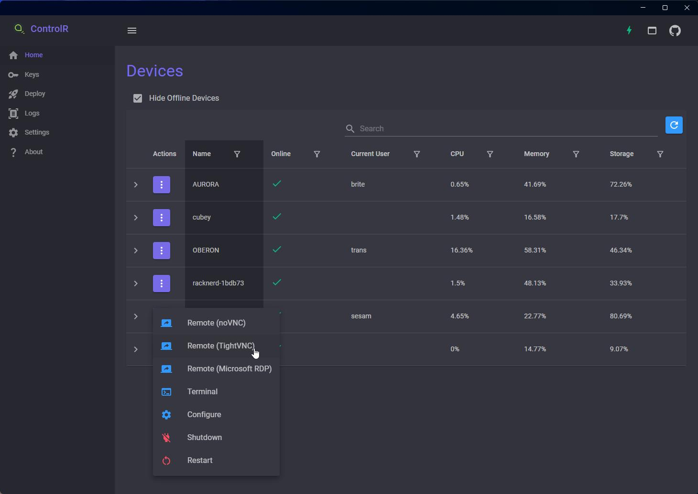

# ControlR
A secure VNC and RDP tunnel built with .NET 8, MAUI, and ASP.NET Core.

Website: https://controlr.app

## Remote Control

Remote control is achieved by proxying VNC and/or RDP connections through secure websockets, eliminating the need to open ports.

ControlR can be set to automatically manage the VNC server on the remote computer.  If enabled, a temporary TightVNC server will be started for each session, and each session will have a random password.  The server will be started in loopback-only mode, so it only accepts connections from localhost.  When the remote control session exits, the VNC server is uninstalled.

For the Viewer, TightVNC is available on Windows, MultiVNC on Android, and noVNC on either.

## How the Zero-Trust Works

Zero-trust is implemented via RSA public/private keypairs.  You generate a keypair the first time you open the Viewer app, and the private key never leaves your local device.

When the agent is installed, you supply the public keys that are allowed to access the device (i.e. `authorized_keys`).

When the viewer connects to the server, every message it sends is signed with your private key, allowing the server to verify your public key.  This is implemented through a custom `AuthenticationHandler`.  Your private key is never shared with the server; only your public key is.

No data is persisted on the server.  There is no database.  All state and identity information is maintained on local devices.

When the agent comes online, it broadcasts its presence via SignalR to public keys in its config file.

When viewers try to connect or issue commands, the signed payload is first verified on the server, then verified again on the agent itself.

This means that the agent doesn't implicitly trust anything coming from the server.  It's able to independently verify all commands issued to it.