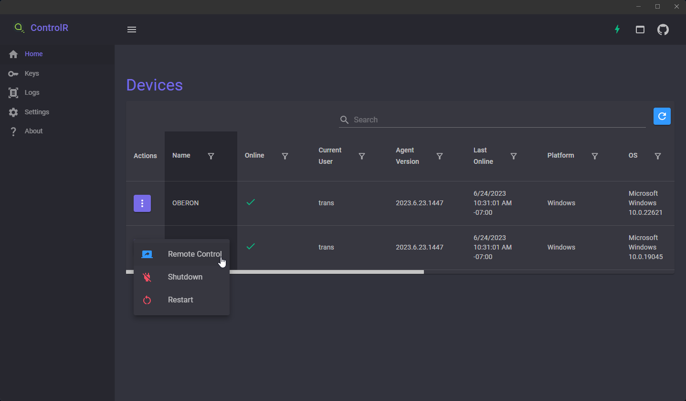
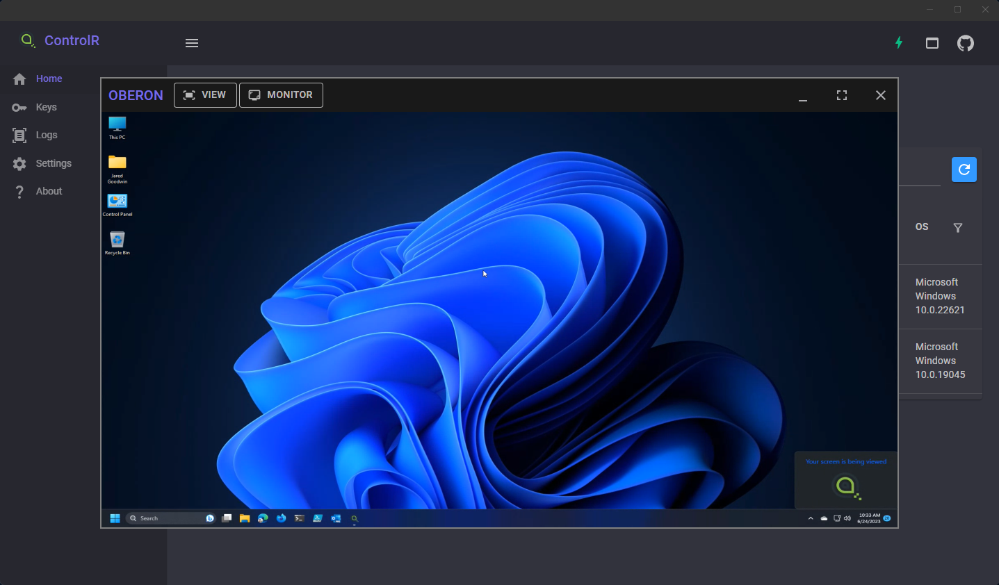
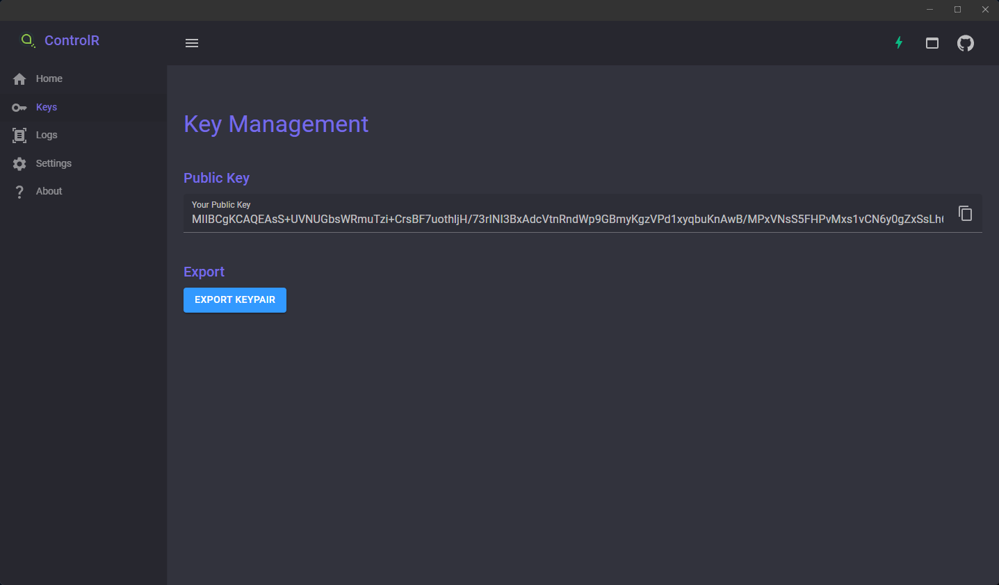

# ControlR
A zero-trust remote control prototype built with .NET 7, MAUI, Blazor WASM, Electron, and WebRTC.

## How It Works
Zero-trust is implemented via public/private keypairs, similar to how ssh works.  When the agent is installed, you supply the public keys that are allowed to access the device (i.e. `authorized_keys`).

This public key comes from the keypair that you create when you first open the viewer app.  When the viewer connects to the server, every message it sends is signed with your private keys, allowing the server to verify your public key.  This is implemented through a custom `AuthenticationHandler`.  Your private key is never shared with the server; only your public key is.

No data is persisted on the server.  There is no database.  All state and identity information is maintained on local devices.

When the agent comes online, it broadcasts its presence via SignalR to public keys in its config file.

When viewers try to connect or issue commands, the signed payload is first verified on the server, then verified again on the agent itself.

This means that the agent doesn't implicitly trust anything coming from the server.  It's able to independently verify all commands issued to it.

https://github.com/lucent-sea/ControlR/assets/20995508/66c38755-3745-4b26-9b92-8f5e9a391af7
