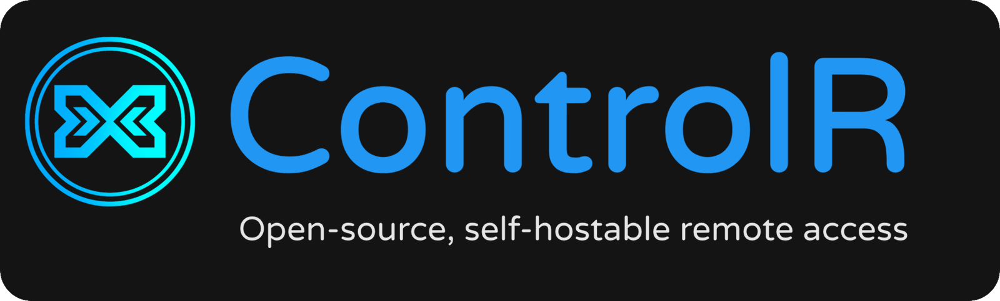
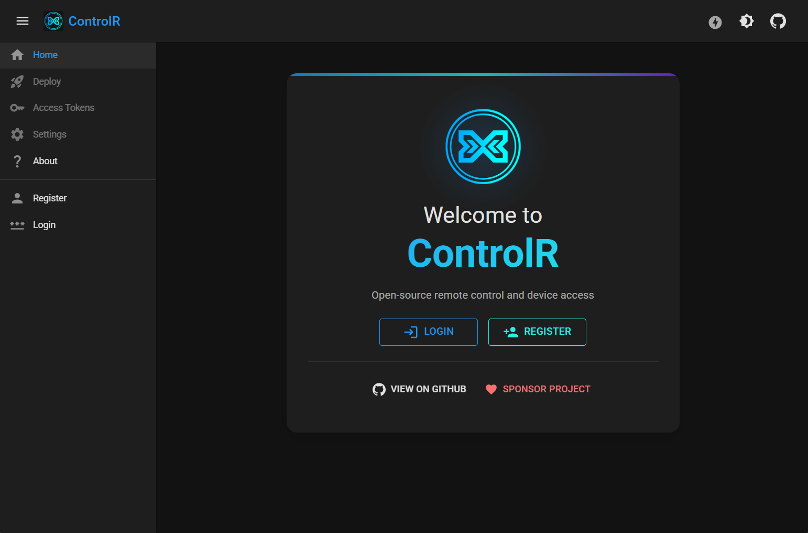
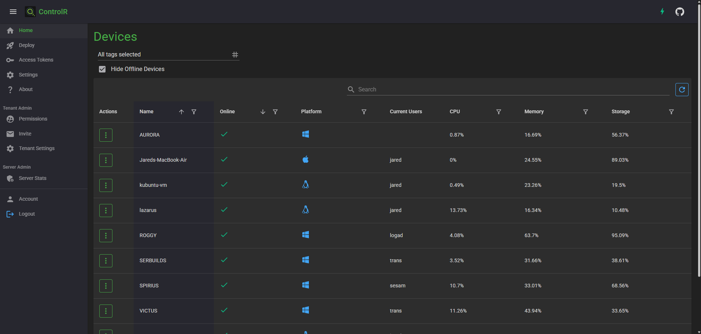
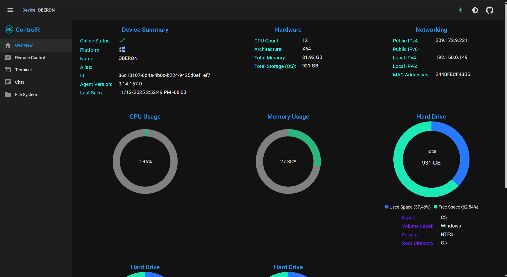
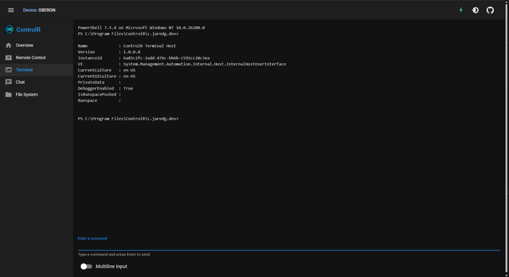
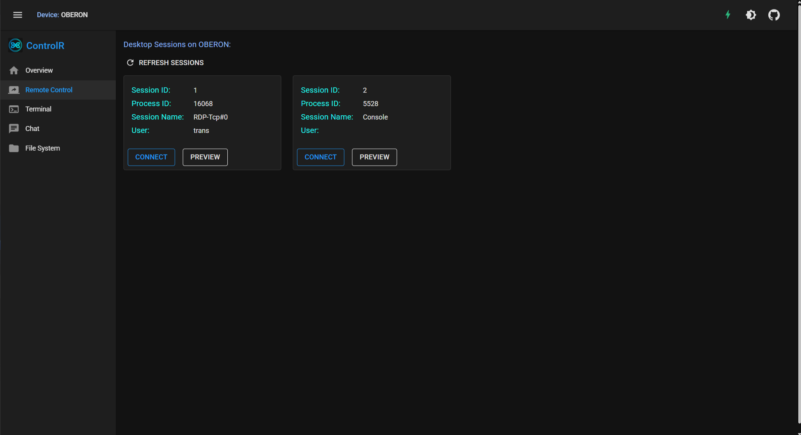
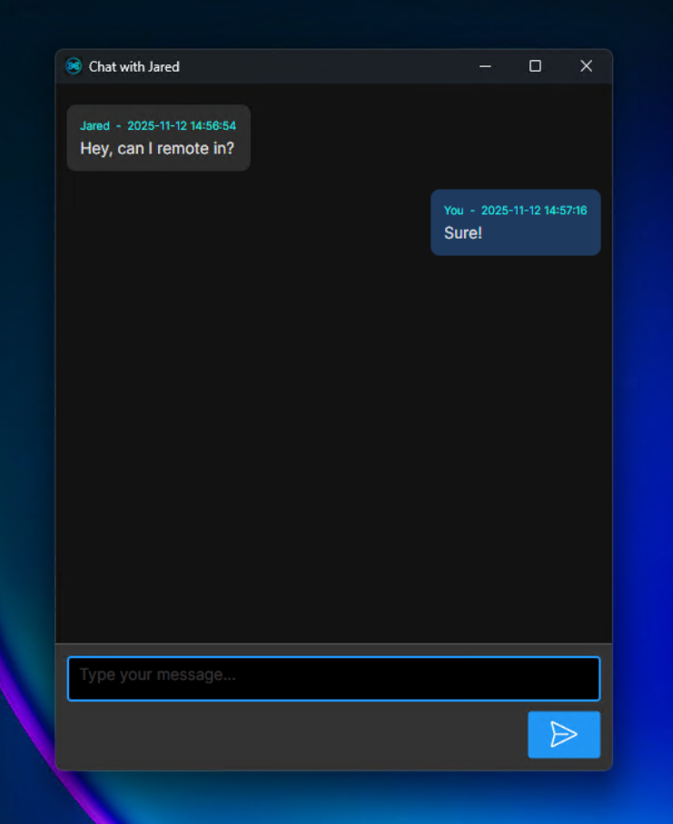
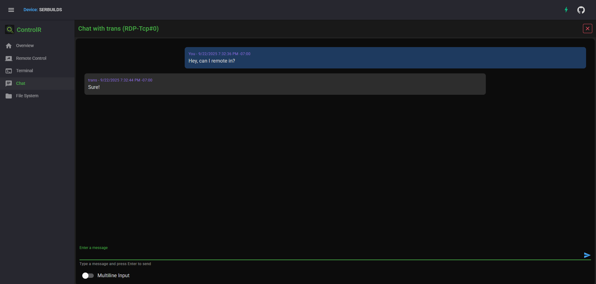
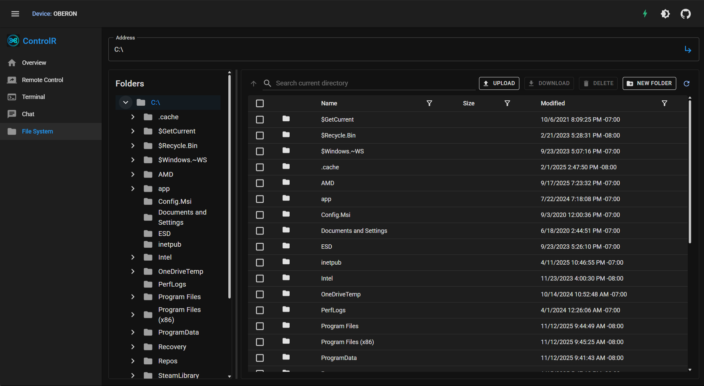

<p style="text-align:center;">
  
</p>

[](https://github.com/bitbound/ControlR/actions/workflows/test.yml)
[](https://deepwiki.com/bitbound/ControlR)
[](https://discord.gg/JWJmMPc72H)

Website: https://controlr.app  
Demo Server: https://demo.controlr.app  (West US)  
Docker: https://hub.docker.com/r/bitbound/controlr  
DeepWiki: https://deepwiki.com/bitbound/ControlR  
Discussions: https://github.com/bitbound/ControlR/discussions  
Project Board: https://github.com/users/bitbound/projects/1  

## Quick Start: 

You can use either environment variables or Docker Secrets to supply sensitive values.  The docker-compose files for both methods are available in the [docker-compose](./docker-compose) folder.

### Using Environment Variables

```
wget https://raw.githubusercontent.com/bitbound/ControlR/main/docker-compose/docker-compose.yml
# Set environment variables for sensitive values or create a .env file
sudo docker compose up -d
```

### Using Docker Secrets

```
wget -O docker-compose.yml https://raw.githubusercontent.com/bitbound/ControlR/main/docker-compose/docker-compose-secrets.yml
# Create secret files and set appropriate permissions (chmod 600)
sudo docker compose up -d
```

You will need to supply sensitive values either via environment variables or Docker Secrets. Choose the method that works best for your setup and security requirements.

See [Docker Secrets](#docker-secrets) section below for more information on supplying sensitive values via Docker Secrets.

See the comments in the docker-compose files for additional configuration info.

Afterward, ControlR should be available on port 5120 (by default). Running `curl http://127.0.0.1:5120/health` should return "Healthy."

> **Important**: Please read the below section regarding [reverse proxy configuration](#reverse-proxy-configuration).

> **Also important**: Until ControlR reaches v1.0, there may be breaking changes between minor version increments.  Please read the release notes for each version before upgrading and follow any migration steps listed.

## Reverse Proxy Configuration:

Some ControlR features require [forwarded headers](https://learn.microsoft.com/en-us/aspnet/core/host-and-deploy/proxy-load-balancer). These concepts are not unique to ASP.NET Core, so it's important to understand them when self-hosting.

When using a reverse proxy, including Cloudflare proxying, the proxy IPs must be trusted by the service receiving the forwarded traffic. By default, ControlR will trust the Docker gateway IP. If `EnableCloudflareProxySupport` option is enabled, the [Cloudflare IP ranges](https://www.cloudflare.com/ips/) will automatically be trusted too.

Every proxy server IP needs to be added to the `X-Forwarded-For` header, creating a chain of all hops until it reaches the service that handles the request. Each proxy server in the chain needs to trust all IPs that came before it. When the request reaches the service, the header should have a complete chain of all proxy servers.

If you have another reverse proxy in front of Docker (e.g., Nginx, Caddy, etc.), it must trust the IPs of any proxies that came before it (e.g., Cloudflare). Likewise, your service in Docker (i.e., ControlR) must also trust the IP of your reverse proxy. If the reverse proxy is on the same machine as the service and is forwarding to localhost, the service will automatically trust it.

Additional proxy IPs can be added to the `KnownProxies` list in the docker-compose file.

If your service is guaranteed to only receive traffic from a trusted reverse proxy, you can set the environment variable `ControlR_AppOptions__EnableNetworkTrust` to `true`.  This will trust all IPs in the forwarded headers.  Only enable this if you are sure that untrusted clients cannot connect directly to your service.

If the public IP for your connected devices is not showing correctly, the problem is likely due to a misconfiguration here.  If `ControlR_Logging__LogLevel__Microsoft.AspNetCore.HttpOverrides` is set to `Debug`, you will see internal logs from Microsoft's `ForwardedHeadersMiddleware` showing the IP that isn't being trusted.

## Server Configuration:

The environment variables for the server can be found in the [docker-compose.yml](./docker-compose/docker-compose.yml) file.  Follow the instructions at the top to supply sensitive values using environment variables and/or Docker Secrets.

## Docker Secrets

ControlR supports using Docker Secrets to supply sensitive configuration values. This is recommended for production deployments where you want to avoid storing sensitive data in environment variables.

### Using Docker Secrets

When using Docker Secrets, sensitive values are read from secret files mounted into the container rather than from environment variables. Each secret file name is used as the configuration key, and the value is the file's contents.

**To use Docker Secrets:**
1. Download the secrets configuration file: `wget https://raw.githubusercontent.com/bitbound/ControlR/main/docker-compose/docker-compose-secrets.yml`
2. Download the example secret files: `wget https://raw.githubusercontent.com/bitbound/ControlR/main/docker-compose/example-secrets/*`
3. Set appropriate permissions on secret files: `chmod 600 example-secrets/*`
4. Update the secret file contents with your actual values
5. Run: `sudo docker compose -f docker-compose-secrets.yml up -d`

### Using Environment Variables

For simpler setups or development environments, you can use environment variables instead of Docker Secrets.

**To use environment variables:**
1. Download the environment variables configuration file: `wget https://raw.githubusercontent.com/bitbound/ControlR/main/docker-compose/docker-compose.yml`
2. Set environment variables for all sensitive values (e.g., `ControlR_POSTGRES_USER`, `ControlR_POSTGRES_PASSWORD`)
3. Or create a `.env` file with the required variables
4. Run: `sudo docker compose up -d`

### ControlR-Specific Secrets

For ControlR, any environment variable beginning with `ControlR_` can be replaced with a similarly-named secret file, minus the "ControlR_" prefix.  

For example, if you create a secret file named `AppOptions__GitHubClientSecret`, it will override the `ControlR_AppOptions__GitHubClientSecret` environment variable.

> Note: The `ControlR_` prefix only applies to environment variables. ASP.NET Core strips the prefix when adding the key to its configuration builder.  It's not needed when supplying configuration keys via other methods, like JSON files or Docker Secrets.

This means you can supply values like:
- `AppOptions__MicrosoftClientSecret`
- `AppOptions__GitHubClientSecret`
- `AppOptions__SmtpPassword`
- `KeyProtectionOptions__CertificatePassword`

by creating corresponding secret files.

The file name on the host can be anything, but the file name inside the container must match the configuration key it is meant to override.

For more information, see the [Docker documentation on secrets](https://docs.docker.com/compose/how-tos/use-secrets/).

## Multi-tenancy

By default, the server is single-tenant, in the sense that there can only be one admin/tech/MSP tenant.  The first user created will be the server and tenant administrator, and subsequent accounts must be explicitly created by the tenant admin.  Customer devices can be organized using tags.

Setting `ControlR_AppOptions__EnablePublicRegistration` to `true` in the docker-compose file will allow anyone to create a new account on the server. A new tenant is created for each account created this way.

The database uses EF Core's [Global Query Filters](https://learn.microsoft.com/en-us/ef/core/querying/filters) feature to isolate tenant data (devices, users, etc.);

## Agent OS Support:

### Windows 11 (x64, x86)

- Full remote control support

### macOS Apple Silicon

Tested on Mac Mini M4 and MacBook Air M1.

- Full remote control support
  - Controlling the login window is only possible after a user has logged in
- Experimental remote control via VNC (Apple Screen Sharing)

### macOS Intel (untested)

ControlR is untested on Intel Macs, but it should work similarly to Apple Silicon Macs.

### Linux AMD64 (latest LTS)

Tested on Fedora KDE, Ubuntu, Kubuntu, and Mint.

- Full remote control support on X11
  - On Ubuntu, you must enable X11 for the login screen
    - Edit `/etc/gdm3/custom.conf` and uncomment the line `WaylandEnable=false`, then reboot
- Full remote control on Wayland via XDG Desktop Portal
  - All dependencies should be preinstalled on the above distributions (except Mint, which is X11).
    - Manual installation: `sudo apt install libgstreamer1.0-0 gstreamer1.0-plugins-base gstreamer1.0-plugins-good`
  - Requires X11 to be used for the login/greeter screen
- Experimental remote control via VNC

### All Operating Systems
- Terminal uses embedded cross-platform PowerShell host

## Agent Log Locations

Agent logs can be streamed in real-time from the Remote Logs page, which can be found at `https://{server-url}/device-access/remote-logs?deviceId={device-id}`.  Please be sure to include relevant log files when reporting issues.

Logs for the agent and desktop client are detailed below. On Windows, the path depends on whether the app is running in Debug or Release mode. On macOS and Linux, the path depends on whether the app is running as root.

Under normal user circumstances, the main agent will run in Release mode as SYSTEM/root. For Mac and Linux, the desktop client will normally run as the user for the current GUI session.  For Windows, the desktop client runs as SYSTEM due to permissions required for capturing and controlling full-screen UAC prompts and the WinLogon desktop.

**Main Agent**
- **Windows**
  - Release: `C:\ProgramData\ControlR\{hostname}\Logs\ControlR.Agent\LogFile{date}.log`
  - Debug: `C:\ProgramData\ControlR\Debug\{hostname}\Logs\ControlR.Agent\LogFile{date}.log`
- **macOS / Linux**
  - Running as root: `/var/log/controlr/{hostname}/ControlR.Agent/LogFile{date}.log`
  - Running as user: `~/.controlr/logs/{hostname}/ControlR.Agent/LogFile{date}.log`

**Desktop Client**
- **Windows**
  - Release: `C:\ProgramData\ControlR\{hostname}\Logs\ControlR.DesktopClient\LogFile{date}.log`
  - Debug: `C:\ProgramData\ControlR\Debug\{hostname}\Logs\ControlR.DesktopClient\LogFile{date}.log`
- **macOS / Linux**
  - Running as root: `/var/log/controlr/{hostname}/ControlR.DesktopClient/LogFile{date}.log`
  - Running as user: `~/.controlr/logs/{hostname}/ControlR.DesktopClient/LogFile{date}.log`

## Permissions

Permissions are implemented via a combination of role-based and resource-based authorization. When the first account is created, all roles are assigned. Subsequent accounts must be explicitly assigned roles.

To access a device, a user must have either the `DeviceSuperuser` role or a matching tag. Tags can be assigned to both users and devices to grant access.

Role Descriptions:

- `AgentInstaller`
  - Able to deploy/install the agent on new devices
- `DeviceSuperUser`
  - Able to access all devices
- `InstallerKeyManager`
  - Able to create and manage installer keys, which are used by the agent to register the device during installation
- `TenantAdministrator`
  - Able to manage users and permissions for the tenant
- `ServerAdministrator`
  - Able to manage and see stats for the server
  - This does not allow access to other tenants' devices or users

## API Spec

A .NET API client for ControlR is published with each release on NuGet: [ControlR.ApiClient](https://www.nuget.org/packages/ControlR.ApiClient/).

Additionally, an OpenAPI spec is created with each build of the server and committed to the repository.  It can be found [here](./ControlR.Web.Server/ControlR.Web.Server.json), or within the artifacts for each GitHub release.  You can use this file to generate API clients in any language.

While debugging, you can also browse the API at https://localhost:7033/scalar/ or https://localhost:7033/openapi/v1.json.

## Personal Access Tokens

Personal Access Tokens (PATs) allow you to authenticate with the ControlR API as your user account without using a username and password. They can be used for integrations, scripts, automation, and other scenarios where you need to authenticate programmatically.

To create a PAT, follow these steps:

1. Go to the **Access Tokens** page in the ControlR web interface.
2. Enter a friendly name for your token.
3. Click the **Create PAT** button.
4. Copy the generated token. **Make sure to store it securely**, as it will never be shown again.
5. Add the token to the `x-personal-token` header in your API requests.

## Logon Tokens
Logon Tokens are time-limited, single-use tokens that allow you to create an authenticated browser session with a **specific device**.  Coupled with PATs, this allows you to create an integration that can open a browser tab to access a particular device.

See the `/api/logon-tokens` endpoint in the API spec.  A successful response includes the full URL, including the logon token, that can be opened in the browser to access the target device.

Remember that the token is single-use, so the URL can only be accessed once.

## Remote Control Input

### On Desktop
- **Zoom**: Ctrl + Shift + Mouse Wheel

### On Mobile/Touch Devices
- **Zoom**: Pinch gesture
- **Right-Click**: Tap and hold
- **Click-and-Drag**: Tap and hold, then drag

## Metrics

Logs, traces, and metrics will be sent to the Aspire Dashboard container. The web interface is exposed on port 18888, and it's secured by the `aspireToken` value.

The dashboard also supports OpenIdConnect authentication. See their [readme](https://github.com/dotnet/aspire/tree/main/src/Aspire.Dashboard) for more information.

You can also add a connection string for Azure Monitor to see your data there. This can be used in combination with the Aspire Dashboard (OTLP) or on its own.


## VNC and Apple Screen Sharing (Experimental)

This is an experimental feature that allows you to control Mac and Linux devices using VNC.  The noVNC client is used for the front-end, and the connection is streamed via websockets through the ControlR server, to the agent, then to the VNC server on the device.

Since the connection to the VNC server is over localhost, you can configure the VNC server to bind to the loopback interface, so it's not exposed to the local network.

## Troubleshooting

### Agent or desktop client not starting or crashing instantly

- Check ControlR logs in the [Log Locations](#agent-log-locations) for any errors.
- Check `Event Viewer -> Windows Logs -> Application` for any .NET runtime errors related to ControlR.
- Check `Event Viewer -> Applications and Services -> Microsoft -> Windows -> CodeIntegrity -> Operational` for any code integrity violations that may be preventing the agent or desktop client from starting.
- Check `Event Viewer -> Applications and Services -> Microsoft -> Windows -> AppLocker -> EXE and DLL` for any AppLocker blocks that may be preventing the agent or desktop client from starting.

## Screenshots
















