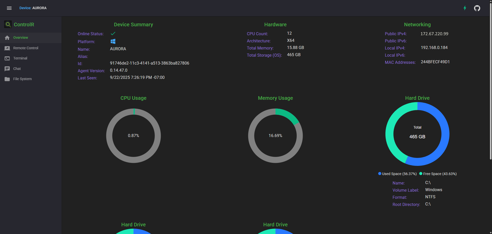
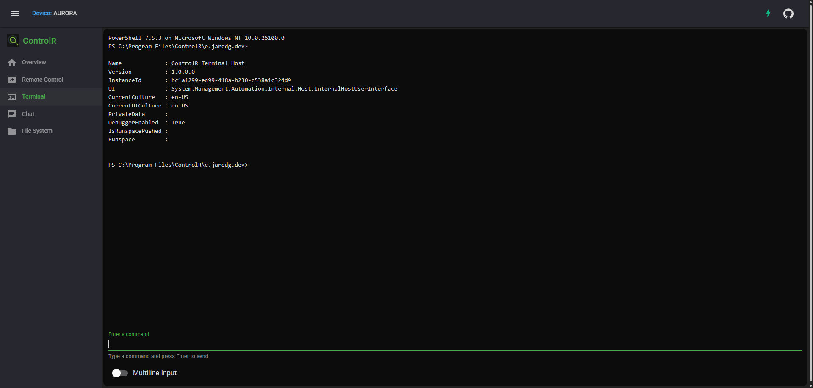
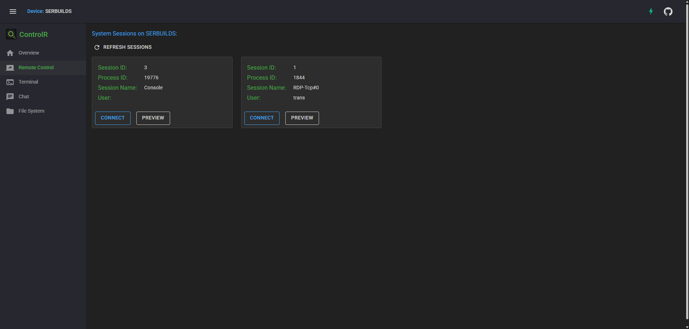
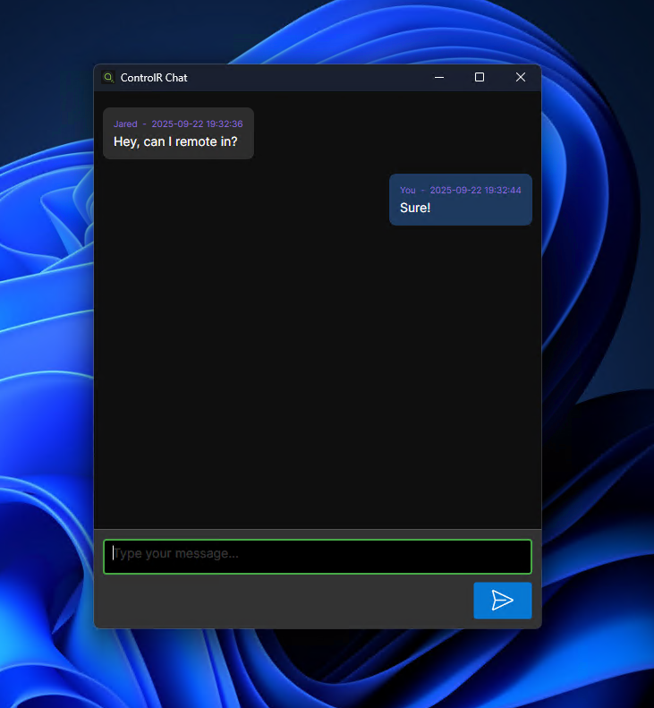
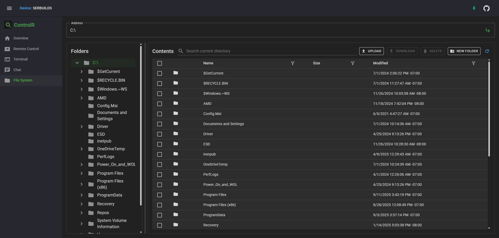

# ControlR

Open-source, self-hostable remote control and remote access.

[](https://github.com/bitbound/ControlR/actions/workflows/test.yml)
[](https://deepwiki.com/bitbound/ControlR)
[](https://discord.gg/JWJmMPc72H)

Website: https://controlr.app  
Docker: https://hub.docker.com/r/translucency/controlr  
DeepWiki: https://deepwiki.com/bitbound/ControlR  
Discussions: https://github.com/bitbound/ControlR/discussions  
Project Board: https://github.com/users/bitbound/projects/1

## Quick Start: 


```
wget https://raw.githubusercontent.com/bitbound/ControlR/main/docker-compose/docker-compose.yml
sudo docker compose up -d
```

At minimum, you will need to supply values for the variables at the top of the compose file. By default, they're expected to be passed in via the environment variables shown to the right of the variables.

See the comments in the compose file for additional configuration info.

Afterward, ControlR should be available on port 5120 (by default). Running `curl http://127.0.0.1:5120/health` should return "Healthy".

## Reverse Proxy Configuration:

Some ControlR features require [forwarded headers](https://learn.microsoft.com/en-us/aspnet/core/host-and-deploy/proxy-load-balancer). These concepts are not unique to ASP.NET Core, so it's important to understand them when self-hosting.

When using a reverse proxy, including Cloudflare proxying, the proxy IPs must be trusted by the service receiving the forwarded traffic. By default, ControlR will trust the Docker gateway IP. If `EnableCloudflareProxySupport` option is enabled, the [Cloudflare IP ranges](https://www.cloudflare.com/ips/) will automatically be trusted too.

Every proxy server IP needs to be added to the `X-Forwarded-For` header, creating a chain of all hops until it reaches the service that handles the request. Each proxy server in the chain needs to trust all IPs that came before it. When the request reaches the servce, the header should have a complete chain of all proxy servers.

If you have another reverse proxy in front of Docker (e.g. Nginx, Caddy, etc.), it must trust the IPs of any proxies that came before it (e.g. Cloudflare). Likewise, your service in Docker (i.e. ControlR) must also trust the IP of your reverse proxy. If the reverse proxy is on the same machine as the service, and is forwarding to localhost, the service will automatically trust it.

Additional proxy IPs can be added to the `KnownProxies` list in the compose file.

If the public IP for your connected devices are not showing correctly, the problem is likely due to a misconfiguration here.

## Multi-tenancy

By default, the server is single-tenant (although you can organize customer tenants via tags). The first user created will be the server and tenant administrator, and subsequent accounts must be explicitly created by the tenant admin.

Setting `ControlR_AppOptions__EnablePublicRegistration` to `true` in the compose file will allow anyone to create a new account on the server. A new tenant is created for each account that is created this way.

The database uses EF Core's [Global Query Filters](https://learn.microsoft.com/en-us/ef/core/querying/filters) feature to isolate tenant data (devices, users, etc.);

## Agent OS Support:

### Windows 11 (x64, x86)

- Full remote control support

### macOS Apple Silicon (tested on M1 running Sequoia)
- Full remote control support
  - Controlling the login window is only possible after a user has logged in
- Experimental remote control via VNC (Apple Screen Sharing)
- Signed using ad-hoc certificate (this may change in the future)

### macOS Intel (untested)
- Experimental remote control via VNC (Apple Screen Sharing)
- Signed using ad-hoc certificate (this may change in the future)

### Ubuntu x64 (latest LTS)

- Full remote control support on X11
  - Tested on Ubuntu, Kubuntu, and Mint
  - On Ubuntu, you must enable X11 for the login screen
    - Edit `/etc/gdm3/custom.conf` and uncomment the line `WaylandEnable=false`, then reboot
- Experimental remote control via VNC

### All Operating Systems
- Terminal uses embedded cross-platform PowerShell host

## Permissions

Permissions are implemented via a combination of role-based and resource-based authorization. When the first account is created, all roles are assigned. Subsequent accounts must be explicitly assigned roles.

To access a device, a user must have either the `DeviceSuperuser` role or a matching tag. Tags can be assigned to both users and devices to grant access.

Role Descriptions:

- `AgentInstaller`
  - Able to deploy/install the agent on new devices
- `DeviceSuperUser`
  - Able to access all devices
- `TenantAdministrator`
  - Able manage users and permissions for the tenant
- `ServerAdministrator`
  - Able to manage and see stats for the server
  - This does not allow access to other tenants' devices or users

## API Spec
An OpenAPI spec is created with each build of the server and committed to the repository.  It can be found [here](/ControlR.Web.Server/ControlR.Web.Server.json), or within the artifacts for each GitHub release.  You can use this file to generate API clients in any language.

While debugging, you can also browse the API at https://localhost:7033/scalar/ or https://localhost:7033/openapi/v1.json.

## Personal Access Tokens

Personal Access Tokens (PATs) allow you to authenticate with the ControlR API as your user account without using a username and password. They can be used for integrations, scripts, automation, and other scenarios where you need to authenticate programmatically.

To create a PAT, follow these steps:

1. Go to the **Access Tokens** page in the ControlR web interface.
2. Enter a friendly name for your token.
3. Click the **Create PAT** button.
4. Copy the generated token. **Make sure to store it securely**, as it will never be shown again.
5. Add the token to the `x-personal-token` header in your API requests.

## Logon Tokens
Logon Tokens are time-limited, single-use tokens that allow you to create an authenticated browser session with a **specific device**.  Coupled with PATs, this allows you to create an integration that can opens a browser tab to access a particular device.

See the `/api/logon-tokens` endpoint in the API spec.  A successful response includes the full URL, including the logon token, that can be opened in the browser to access the target device.

Remember that the token is single-use, so the URL can only be accessed once.

## Metrics

Logs, traces, and metrics will be sent to the Aspire Dashboard container. The web interface is exposed on port 18888, and it's secured by the `aspireToken` value.

The dashboard also supports OpenIdConnect authentication. See their [readme](https://github.com/dotnet/aspire/tree/main/src/Aspire.Dashboard) for more information.

You can also add a connection string for Azure Monitor to see your data there. This can be used in combination with the Aspire Dashboard (OTLP) or on its own.

## Relay Servers

ControlR has the ability to integrate with geographically-distributed relay servers and transfer remote control sessions to a server closest to you. See the comments in the Docker Compose file for configuration information.

Relay servers are currently disabled on the public server (https://controlr.app), which is located in Seattle, WA.

## VNC and Apple Screen Sharing (Experimental)

This is an experimental feature that allows you to control Mac and Linux devices using VNC.  The noVNC client is used for the front-end, and the connection is streamed via websockets through the ControlR server, to the agent, then to the VNC server on the device.

Since the connection to the VNC server is over localhost, you can configure the VNC server to bind to the loopback interface, so it's not exposed to the local network.

You can configure the VNC port in the agent's appsettings.json file, under `AppOptions:VncPort`. If it is omitted, it will use the default VNC port of 5900.

If the project gains support, I intend to add full remote control support for Mac.

## Screenshots












